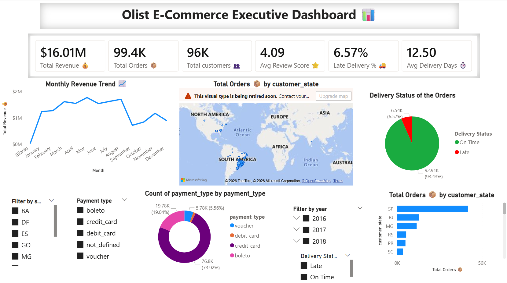
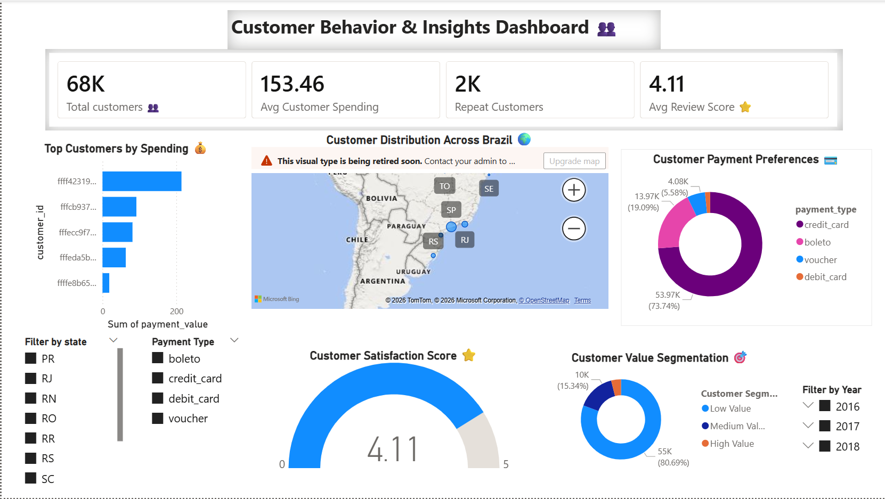
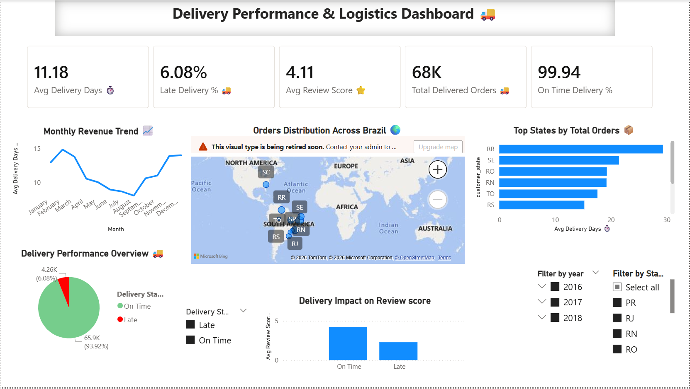
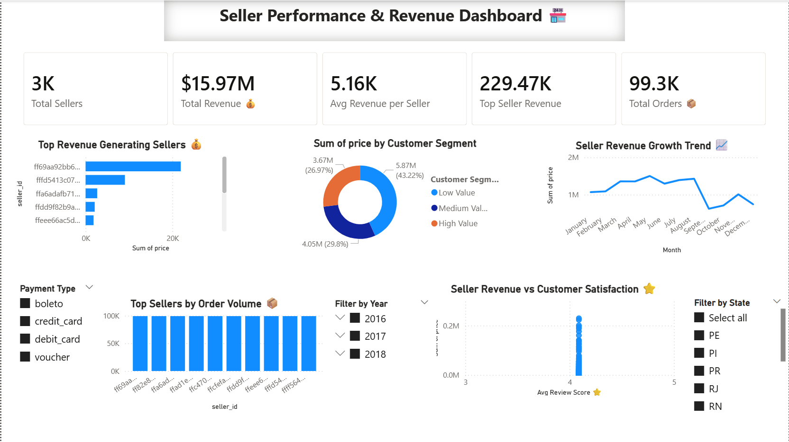

# Olist-Ecommerce-Business-Analytics-Using-POWER-BI
Interactive E-Commerce Business Analytics Dashboard built using Power BI, SQL, DAX, and the Olist dataset to analyze sales, customers, delivery performance, and seller insights.

## 📌 Project Overview
This project is an end-to-end Business Intelligence and Data Analytics solution built using the Brazilian Olist E-Commerce dataset. The project focuses on analyzing sales performance, customer behavior, delivery logistics, and seller performance using SQL and Power BI.
The dashboard provides interactive insights that help understand business operations, customer satisfaction, revenue generation, and logistics efficiency.
---

## 🚀 Tools & Technologies Used
* Power BI
* MySQL
* SQL
* DAX
* Power Query
* Data Modeling
* Data Visualization

---

# 📊 Dashboard Pages
## 1️⃣ Executive Dashboard
Provides high-level business KPIs and overall performance insights:
* Total Revenue
* Total Orders
* Total Customers
* Average Review Score
* Delivery Performance
* Monthly Revenue Trend
* State-wise Order Analysis
---
## 2️⃣ Customer Analytics Dashboard
Analyzes customer behavior and customer satisfaction:
* Top Customers by Spending
* Repeat Customers
* Customer Distribution
* Payment Preferences
* Customer Satisfaction Analysis
---
## 3️⃣ Delivery Analytics Dashboard
Focuses on logistics and delivery performance:
* Average Delivery Days
* Late Delivery Percentage
* On-Time vs Late Deliveries
* State-wise Delivery Delays
* Delivery Trend Analysis
* Customer Satisfaction vs Delivery Status
---
## 4️⃣ Seller Performance Dashboard
Analyzes seller contributions and business performance:
* Top Revenue Generating Sellers
* Seller Revenue Trends
* Seller Distribution by State
* Order Volume by Sellers
* Seller Revenue Contribution
---
# 🧠 Key Business Insights
* Credit cards are the most preferred payment method.
* Late deliveries significantly reduce customer review scores.
* Revenue generation is concentrated among a few top-performing sellers.
* Most deliveries are completed on time.
* Customer activity and order distribution vary across different states.
---
# 🗂️ Dataset Information
Dataset Source:
Brazilian Olist E-Commerce Public Dataset
The dataset includes:
* Customers
* Orders
* Payments
* Reviews
* Products
* Sellers
* Geolocation Data
---
# 📈 Skills Demonstrated
* SQL Query Writing
* Data Cleaning & Transformation
* Data Modeling
* DAX Measures
* KPI Development
* Dashboard Design
* Business Analytics
* Data Visualization
* Business Storytelling
---
# 📷 Dashboard Preview
## Executive Dashboard

## Customer Analytics Dashboard

## Delivery Analytics Dashboard

## Seller Performance Dashboard

---

### 🔗 Project Outcome
This project demonstrates the complete workflow of a Data Analyst:

* Raw data handling
* SQL analysis
* Business KPI creation
* Interactive dashboard development
* Business insight generation

---

# 👨‍💻 Author

Kotha Sai Srinath

Aspiring Data Analyst | SQL | Power BI | Data Analytics

